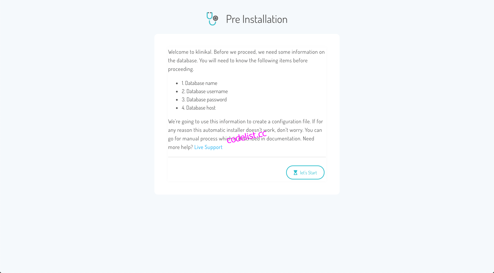
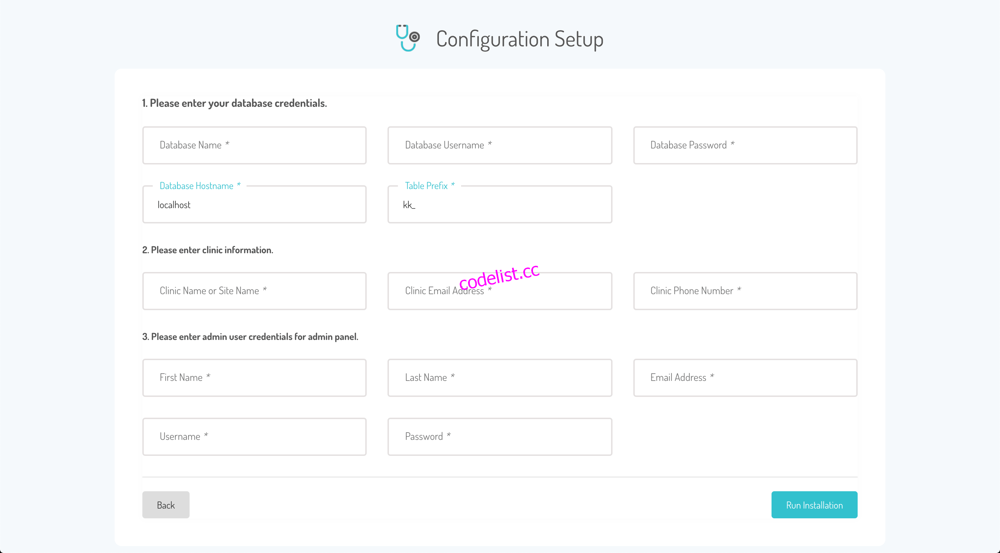
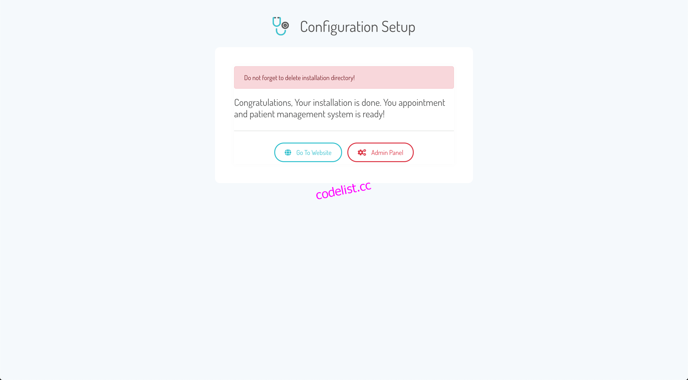
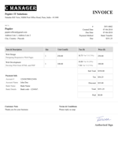
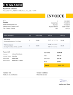
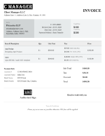
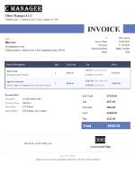
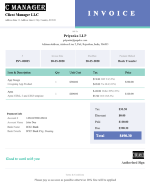
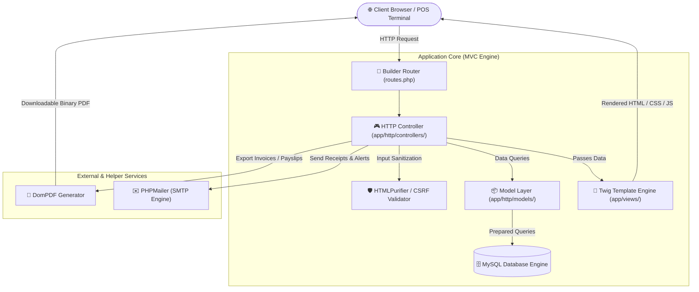
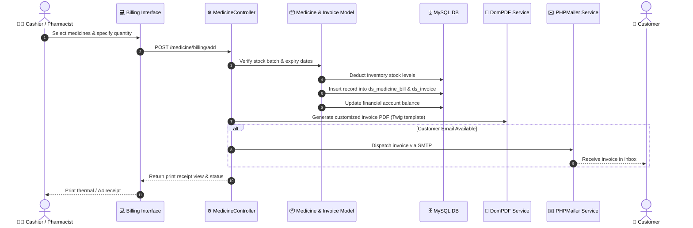

<div align="center">

<!-- Animated Header Banner -->


<!-- Project Brand Logo -->
<p align="center">
  
</p>

### Modern • Secure • Modular • High-Performance Pharmacy ERP

<p align="center">
  <a href="https://github.com/LALITHD-21/Pharmacy-Management-System/stargazers"></a>
  <a href="https://github.com/LALITHD-21/Pharmacy-Management-System/network/members"></a>
  <a href="https://github.com/LALITHD-21/Pharmacy-Management-System/issues"></a>
  <a href="LICENSE"></a>
</p>

<p align="center">
  
  
  
  
  
  
  
</p>

---

<p align="center">
  <b>A comprehensive, all-in-one Pharmacy Management System (Drug Store ERP) designed to streamline daily retail, wholesale, clinical, and hospital pharmacy workflows. Built on a clean, scalable PHP MVC architecture featuring point-of-sale billing, batch-level stock control, automated multi-template PDF invoicing, integrated accounting, HR payroll, and real-time business intelligence reports.</b>
</p>

<br/>

<p align="center">
  <a href="#-quick-tour--screenshots">📸 Screenshots</a> •
  <a href="#-core-modules--features">⚡ Features</a> •
  <a href="#-system-architecture">🏗️ Architecture</a> •
  <a href="#-pdf-invoice-showcase">📑 Invoicing Styles</a> •
  <a href="#-database-schema">🗄️ Database</a> •
  <a href="#-installation-guide">⚙️ Installation</a> •
  <a href="#-default-credentials">🔑 Credentials</a> •
  <a href="#-routes-and-navigation">🌐 Routes</a> •
  <a href="#-security--hardening">🔒 Security</a>
</p>

</div>

---

## 📸 Quick Tour & Screenshots

### 🚀 3-Step Automated Web Installer
Installing and configuring the system takes under 60 seconds with the built-in wizard:

| Step 1: Database Setup | Step 2: Administrator Account | Step 3: Setup Complete |
|:---:|:---:|:---:|
| <a href="Documentation/images/Install-1.png"></a> | <a href="Documentation/images/Install-2.png"></a> | <a href="Documentation/images/Install-3.png"></a> |
| *Database host, user & credentials verification* | *Store information, administrator email & password* | *System ready with instant dashboard access* |

---

## 📑 PDF Invoice Showcase

The system features **5 distinct, high-resolution printable PDF invoice templates** powered by DomPDF:

<div align="center">
<table>
  <tr>
    <td align="center" width="20%">
      <b>Style 1 — Modern Gradient</b><br/><br/>
      <br/>
      <code>invoice_pdf_1.twig</code>
    </td>
    <td align="center" width="20%">
      <b>Style 2 — Clean Minimalist</b><br/><br/>
      <br/>
      <code>invoice_pdf_2.twig</code>
    </td>
    <td align="center" width="20%">
      <b>Style 3 — Corporate Blue</b><br/><br/>
      <br/>
      <code>invoice_pdf_3.twig</code>
    </td>
    <td align="center" width="20%">
      <b>Style 4 — Elegant Header</b><br/><br/>
      <br/>
      <code>invoice_pdf_4.twig</code>
    </td>
    <td align="center" width="20%">
      <b>Style 5 — Compact Grid</b><br/><br/>
      <br/>
      <code>invoice_pdf_5.twig</code>
    </td>
  </tr>
</table>
</div>

---

## ⚡ Core Modules & Features

```
                               ┌──────────────────────────────────────────────────────────┐
                               │             PHARMACY MANAGEMENT SYSTEM (ERP)             │
                               └────────────────────────────┬─────────────────────────────┘
                                                            │
         ┌───────────────────┬──────────────────────┬───────┴──────────────┬────────────────────┬────────────────────┐
         ▼                   ▼                      ▼                      ▼                    ▼                    ▼
   [💊 Pharmacy POS]   [📦 Inventory]         [👥 CRM & Doctors]    [💼 HR & Payroll]    [💰 Finance/Ledger]   [📊 Analytics]
   • Fast Checkout     • Batch Tracking       • Customer Profiles   • Staff Attendance   • Multi-Account       • 11 Reports
   • Barcode Search    • Supplier Ingestion   • Doctor Prescriptions• Salary Templates   • Expense Categorizer • PDF/Excel Export
   • Multi-tax/Discount• Low-Stock Alerts     • History Tracking    • Payslip Generator  • Income vs Expense   • Visual Charts
```

<br/>

### 1. 💊 POS Billing & Medicine Sales
- **Rapid Item Lookup**: Search medicines dynamically by generic name, brand name, category, or barcode.
- **Batch Selection**: Real-time batch availability with expiry date inspection during checkout.
- **Dynamic Tax & Discounts**: Line-item and total-order percentage/flat tax and discount calculations.
- **Multi-Payment Modes**: Split and accept Cash, Credit/Debit Cards, Bank Wire, Cheque, or Net Banking.
- **Direct Email Dispatch**: One-click dispatch of PDF bills directly to customer email addresses.

### 2. 📦 Inventory, Stock & Suppliers
- **Batch-Level Expiry Control**: Prevent accidental sale of expired stock with automated quarantine notifications.
- **Supplier Purchasing**: Create, manage, and verify incoming Purchase Orders with unit costs and quantity logging.
- **Stock Adjustment**: Immediate write-offs for damaged, returned, or recalled pharmaceutical items.
- **CSV Bulk Import**: Upload hundreds of medicines at once via standard CSV spreadsheet formats.
- **Out-of-Stock Forecast**: Dedicated dashboard alert feed highlighting critically low inventory items.

### 3. 👥 Customer & Doctor Relationship Management
- **Customer CRM**: Maintain comprehensive patient files including contact info, address, and purchase logs.
- **Doctor Directory**: Maintain physician registrations, specializations, clinics, and prescription referrals.
- **Prescription Association**: Directly link dispensing transactions to referring doctors for audit compliance.

### 4. 💼 Human Resource Management & Payroll (HRMS)
- **Staff Attendance Tracking**: Record daily check-ins, check-outs, and work logs for all pharmacy staff members.
- **Flexible Salary Templates**: Define base pay, overtime, travel allowance, health insurance, and tax deductions.
- **Automated Payroll Engine**: Generate professional payslips in downloadable PDF format with single-click payment history.
- **Internal Noticeboard**: Broadcast internal announcements, shifts, and policy changes to all employees.

### 5. 💰 Finance, Accounts & Double-Entry Ledger
- **Multi-Account Banking**: Manage cash drawers, primary bank accounts, and reserve vaults with live balance reconciliation.
- **Expense Categorization**: Granular tagging for operational expenses (utilities, rent, refrigeration, transportation).
- **Tax Management**: Create and configure single or tiered sales taxes (GST, VAT, Sales Tax).

### 6. 📬 Communication, Mailer & Automated Alerts
- **SMTP Gateway**: Fully compatible with Gmail SMTP, SendGrid, Amazon SES, Mailgun, and custom cPanel mail servers.
- **Customizable Templates**: Rich HTML email layouts with dynamic placeholders for invoices, welcome letters, and payslips.
- **Bulk Broadcasts**: Send healthcare alerts, seasonal vaccine announcements, and special discounts to subscribers.
- **Email Delivery Logs**: Comprehensive delivery auditing with timestamps, recipient records, and error diagnostics.

---

## 🏗️ System Architecture

The application is structured around a strict **MVC (Model-View-Controller)** pattern with clean separation of concerns:



### Transaction Processing Flow



---

## 🗄️ Database Schema

The database contains **31 optimized tables** with foreign key constraints, indexes, and UTF-8 encoding:

<details>
<summary><b>🔍 Click here to view the complete list of database tables and their functions</b></summary>
<br/>

| Table Name | Prefix | Description & Purpose |
|:---|:---:|:---|
| `accounts` | `ds_` | Chart of financial accounts (cash in hand, banks, petty cash) |
| `account_transaction` | `ds_` | Double-entry journal entries for income, expense & transfers |
| `attached_files` | `ds_` | Uploaded supporting documents, attachments, and prescriptions |
| `customers` | `ds_` | Registered customer directory with credit terms & contact records |
| `doctors` | `ds_` | Referring physicians, qualifications, clinics, and contact details |
| `email_logs` | `ds_` | Historical dispatch log of all system emails with status codes |
| `email_template` | `ds_` | Dynamic HTML email templates for bills, welcome, and payroll |
| `expenses` | `ds_` | Itemized business expense disbursements |
| `expense_type` | `ds_` | Categorical classifications for expense auditing |
| `invoice` | `ds_` | Master record for customer invoices and sales orders |
| `items` | `ds_` | Generic billing goods and services catalog |
| `login_attempts` | `ds_` | IP and credential tracker protecting against brute-force attacks |
| `media` | `ds_` | Centralized digital asset and image library |
| `medicines` | `ds_` | Master pharmaceutical catalog (generic name, brand, dosages) |
| `medicine_batch` | `ds_` | Batch numbers, supplier lot IDs, manufactured/expiry dates, qty |
| `medicine_bill` | `ds_` | POS dispensing sales orders and itemized lines |
| `medicine_category` | `ds_` | Therapeutic categories (Antibiotics, Analgesics, Vitamins, etc.) |
| `medicine_purchase` | `ds_` | Inward supplier purchase orders and procurement pricing |
| `menu` | `ds_` | Dynamic system navigation links and view access rules |
| `noticeboard` | `ds_` | Internal communication announcements for staff members |
| `payments` | `ds_` | Transaction receipt ledger for invoice payment collections |
| `payment_method` | `ds_` | Configured tender types (Cash, Stripe, POS, Cheque, Wire) |
| `salarytemplate` | `ds_` | Compensation structures (base, bonuses, tax deductions) |
| `setting` | `ds_` | Global application parameters, company branding, localization |
| `staff_attendance` | `ds_` | Daily employee attendance, punch-in/out records |
| `staff_payment` | `ds_` | Processed payroll history and salary disbursement proofs |
| `subscribe` | `ds_` | Marketing and newsletter subscriber database |
| `suppliers` | `ds_` | Pharmaceutical manufacturers, wholesalers, and vendors |
| `taxes` | `ds_` | Dynamic sales tax calculations and rates |
| `users` | `ds_` | System operators, pharmacists, cashiers, and administrators |
| `user_role` | `ds_` | Role-based authorization matrix and permissions |

</details>

---

## 📊 Analytics & Reporting Engine

The system features **11 built-in intelligence reports** equipped with date-range filters, category drilldowns, and exportable outputs:

```
┌────────────────────────────────────────────────────────────────────────────────────────────────┐
│                                 11 ENTERPRISE PHARMACY REPORTS                                 │
├──────────────────────────┬──────────────────────────┬──────────────────────────────────────────┤
│ 🧾 Medicine Billing      │ 🛒 Purchase Orders       │ 📦 Inventory Valuation                   │
│ 💸 Operational Expenses  │ 📈 Profit & Loss (P&L)   │ 🏦 Account Statements                    │
│ 📄 Customer Invoices     │ 💰 Staff Payroll & Wage  │ ❌ Out-of-Stock & Expiry Alert           │
│ 📋 General Activity Audit│ 💳 Tax & Tender Summary  │                                          │
└──────────────────────────┴──────────────────────────┴──────────────────────────────────────────┘
```

---

## ⚙️ Installation Guide

### 📋 Prerequisites Checklist

Verify your server satisfies the minimum environment requirements:

- **PHP**: `7.4` or `8.0+`
- **PHP Extensions**:
  - `pdo` & `pdo_mysql` (Database connectivity)
  - `mbstring` (Multibyte string processing)
  - `openssl` (Encryption and secure tokens)
  - `fileinfo` (MIME-type detection for uploads)
  - `gd` or `imagick` (Image processing)
  - `curl` (External web communication)
- **Web Server**: Apache (`mod_rewrite` enabled) or Nginx
- **Database**: MySQL `5.7+` or MariaDB `10.3+`

---

### Option A: ⚡ Automated Web GUI Setup (Recommended)

1. **Clone the repository**:
   ```bash
   git clone https://github.com/LALITHD-21/Pharmacy-Management-System.git
   cd Pharmacy-Management-System
   ```

2. **Deploy files to web server**:
   Copy the contents of the `Upload/` folder into your web root:
   - **XAMPP (Windows)**: `C:\xampp\htdocs\pharmacy\`
   - **WAMP (Windows)**: `C:\wamp64\www\pharmacy\`
   - **LAMP (Linux)**: `/var/www/html/pharmacy/`

3. **Create an empty MySQL database**:
   ```sql
   CREATE DATABASE pharmacy_db CHARACTER SET utf8mb4 COLLATE utf8mb4_unicode_ci;
   ```

4. **Launch Web Installer**:
   Open your browser and navigate to:
   ```
   http://localhost/pharmacy/install
   ```
   Follow the on-screen steps:
   - Provide database name, username, and password.
   - Enter your pharmacy name, email, and admin password.
   - Click **Finish Installation**.

5. **Security Cleanup**:
   > ⚠️ **CRITICAL**: Delete the `/install` directory immediately after setup:
   ```bash
   rm -rf /var/www/html/pharmacy/install
   ```

---

### Option B: 🛠️ Manual CLI Installation

1. **Import Database Schema**:
   Import the pre-packaged SQL schema into your MySQL database:
   ```bash
   mysql -u root -p pharmacy_db < Upload/install/builder/drugstore.sql
   ```

2. **Configure Database Connection**:
   Open `Upload/config/config.php` and configure your credentials:
   ```php
   /* Store Branding */
   define('NAME', 'My Pharmacy Drug Store');
   define('URL', 'http://localhost/pharmacy/');

   /* Database Connection */
   define('DB_HOSTNAME', 'localhost');
   define('DB_USERNAME', 'root');
   define('DB_PASSWORD', 'your_password');
   define('DB_DATABASE', 'pharmacy_db');
   define('DB_PREFIX', 'ds_');

   /* Security Salts (Generate unique random strings) */
   define('AUTH_KEY', 'A;u7qk;tA&lK|jU9i7QHx(3EX2sLcPf&n0NE1{wOPw5tgNfIo~VNOizaJZAi3D{U');
   define('LOGGED_IN_SALT', '|0U0D)UJXG861aBWIyPYKd*5a)0T86U&&cvhZm#T8mP1tK29GvLvZgJC5OCj7UeD');
   define('TOKEN', 'JqAC;3nnVa<}HQzj;GUV|6?B27uade8{qTE-QK#bmvg-2p0V}MD;%0w;gD}gsC)K');
   define('TOKEN_SALT', 'QvDl>72fXqu0Dy;KbXkAf~XX-GLEzwEx*LLy1Wj%2W5<)Th0>LK3)v9tx5cUyi~h');
   ```

3. **Set Linux File Permissions**:
   ```bash
   chmod -R 755 /var/www/html/pharmacy
   chmod -R 777 /var/www/html/pharmacy/public/uploads
   chmod -R 777 /var/www/html/pharmacy/builder/storage
   ```

---

## 🔑 Default Credentials

If you installed via the manual SQL import method, log in using the pre-seeded credentials:

```
┌────────────────────────────────────────────────────────┐
│               DEFAULT SYSTEM CREDENTIALS               │
├───────────────────┬────────────────────────────────────┤
│ 🌐 Portal URL     │ http://localhost/pharmacy/         │
│ 👤 Username       │ admin                              │
│ 🔑 Password       │ Test@123                           │
│ 🛡️ Access Level   │ Super Administrator                │
└───────────────────┴────────────────────────────────────┘
```

> 🔒 **Security Notice**: Immediately navigate to **Profile → Change Password** after your first login to secure the instance.

---

## 🌐 Routes and Navigation

<details>
<summary><b>🗺️ Click here to view the full application route map</b></summary>
<br/>

| Route Path | Method | Controller Action | Description |
|:---|:---:|:---|:---|
| `/login` | `GET/POST` | `LoginController@index` | User authentication & session init |
| `/forgot` | `GET/POST` | `LoginController@forgot` | Password recovery workflow |
| `/dashboard` | `GET` | `DashboardController@index` | Main operational KPI dashboard |
| `/medicines` | `GET` | `MedicineController@index` | Pharmacy inventory master list |
| `/medicine/add` | `GET/POST` | `MedicineController@medicineAction` | Create new medicine record |
| `/medicine/stock` | `GET/POST` | `MedicineController@stockList` | Batch-level inventory adjustments |
| `/medicine/purchase`| `GET/POST` | `MedicineController@purchase` | Supplier procurement & POs |
| `/medicine/billing` | `GET/POST` | `MedicineController@medicineBilling`| Point of sale checkout |
| `/medicine/billing/pdf`| `GET` | `MedicineController@medicineBillingPdf`| Export thermal/A4 sales bill |
| `/invoices` | `GET` | `InvoiceController@index` | Customer invoice directory |
| `/invoice/add` | `GET/POST` | `InvoiceController@indexAction` | Generate comprehensive invoice |
| `/invoice/pdf` | `GET` | `InvoiceController@indexPdf` | Render DomPDF template |
| `/customers` | `GET/POST` | `CustomerController@index` | Patient & customer profiles |
| `/doctors` | `GET/POST` | `DoctorController@index` | Physician registry & referrals |
| `/expenses` | `GET/POST` | `ExpenseController@index` | Operational expense management |
| `/salarytemplate` | `GET/POST` | `SalarytemplateController@index` | Define pay structures |
| `/managesalary` | `GET/POST` | `ManagesalaryController@index` | Process monthly staff salaries |
| `/staffattendance` | `GET/POST` | `StaffattendanceController@index` | Daily attendance logger |
| `/send/email` | `GET/POST` | `SenderController@indexMail` | Single email dispatch |
| `/sendbulk/email` | `GET/POST` | `SenderController@indexBulkMail`| Bulk newsletter / alert campaign |
| `/reports` | `GET` | `ReportController@index` | Executive intelligence reports |
| `/suppliers` | `GET/POST` | `SettingController@suppliers` | Vendor relationship management |
| `/tax` | `GET/POST` | `FinanceController@tax` | Sales tax configuration |

</details>

---

## 🔒 Security & Hardening

```
  ┌────────────────────────────────────────────────────────────────────────┐
  │                           SECURITY ARCHITECTURE                        │
  ├────────────────────────────────────────────────────────────────────────┤
  │  🛡️ CSRF Protection      : Token verification on all POST/PUT actions   │
  │  💉 SQL Injection Shield : 100% PDO Prepared Statements                │
  │  🧼 XSS Neutralization   : HTMLPurifier cleanses all incoming payloads │
  │  🔐 Cryptographic Salts  : SHA-256 password & session hashing          │
  │  🚪 RBAC Controls        : Granular per-role view and action masks     │
  │  🚨 Brute-Force Log      : Failed login lockout tracking (ds_login)    │
  └────────────────────────────────────────────────────────────────────────┘
```

### Production Hardening Guidelines:
1. **Rotate Cryptographic Keys**: Edit `AUTH_KEY`, `LOGGED_IN_SALT`, `TOKEN`, and `TOKEN_SALT` in `config/config.php`.
2. **Disable Debugging**: Turn off `display_errors` in `php.ini` (`display_errors = Off`).
3. **Enforce HTTPS**: Configure SSL certificates (e.g. Let's Encrypt) to encrypt customer and transaction traffic.
4. **Restrict Direct Access**: Ensure Apache `.htaccess` or Nginx blocks web access to `config/`, `builder/`, and `.git/`.

---

## 🎨 SCSS Theming & Customization

The interface styling is modular and built on **Bootstrap 5** and **SASS / SCSS**:

```
Upload/public/sass/
├── _variable.scss       <-- Edit brand colors, typography, border-radii
├── _color.scss          <-- Palette mapping
├── _responsive.scss     <-- Mobile, tablet, POS responsive breakpoints
├── _typography.scss     <-- Google Fonts ('Poppins', 'Dosis') integration
└── style.scss           <-- Main SCSS manifest file
```

To recompile changes to `Upload/public/css/style.css`, use any standard SASS compiler:
```bash
sass Upload/public/sass/style.scss Upload/public/css/style.css --style compressed
```

---

## 🤝 Contributing

We welcome community contributions, bug reports, and feature proposals!

1. **Fork** the project repository.
2. **Create a Feature Branch**:
   ```bash
   git checkout -b feature/AmazingNewFeature
   ```
3. **Commit Your Changes**:
   ```bash
   git commit -m "feat: Add barcode thermal printing support"
   ```
4. **Push to GitHub**:
   ```bash
   git push origin feature/AmazingNewFeature
   ```
5. **Submit a Pull Request** explaining your modifications.

---

## 📄 License

This software is released under the **[MIT License](LICENSE)**. You are free to inspect, customize, extend, and deploy it for personal, commercial, or institutional use.

---

## 👨‍💻 Maintainer & Acknowledgements

<div align="center">

**Developed & Maintained by**

### **LALITH D**
[](https://github.com/LALITHD-21)
[](https://github.com/LALITHD-21/Pharmacy-Management-System)

<br/>

⭐ **Found this project helpful? Leave a Star on GitHub!** ⭐

<br/>


</div>
